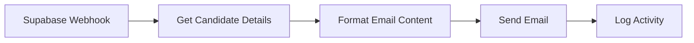
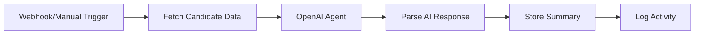
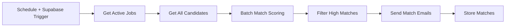
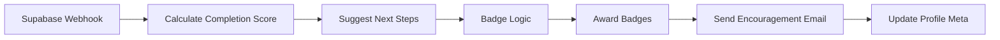
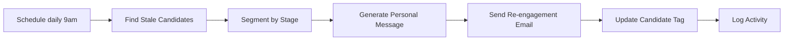
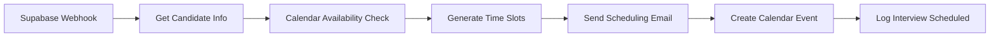
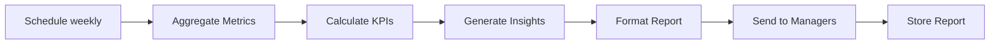

# 🚀 Recruitment Platform - N8N Automation Architecture

> Complete PRD suite: 2 base requirements + 5 high-value workflows

[](https://github.com)
[](https://github.com)
[](https://github.com)
[](https://github.com)

## 📋 Table of Contents

- [Overview](#overview)
- [Implementation Summary](#implementation-summary)
- [Base Requirements (Critical)](#base-requirements-critical)
  - [WF-BASE-01: Application Status Change Notification](#wf-base-01-application-status-change-notification)
  - [WF-BASE-02: AI-Powered Candidate Summary Generator](#wf-base-02-ai-powered-candidate-summary-generator)
- [Marketing Workflows](#marketing-workflows)
  - [WF-MARK-01: Smart Job Matching & Notification Engine](#wf-mark-01-smart-job-matching--notification-engine)
- [Onboarding Workflows](#onboarding-workflows)
  - [WF-ONBOARD-01: Progressive Profile Completion with Achievement Badges](#wf-onboard-01-progressive-profile-completion-with-achievement-badges)
- [Follow-up Workflows](#follow-up-workflows)
  - [WF-FOLLOWUP-01: Automated Candidate Re-engagement](#wf-followup-01-automated-candidate-re-engagement)
- [Operations Workflows](#operations-workflows)
  - [WF-OPS-01: Interview Scheduling Assistant](#wf-ops-01-interview-scheduling-assistant)
  - [WF-INTEL-01: Recruiter Performance Dashboard Auto-Report](#wf-intel-01-recruiter-performance-dashboard-auto-report)

---

## 🎯 Overview

This document outlines a comprehensive automation architecture for a recruitment platform using N8N workflows integrated with Supabase and AI capabilities.

### Key Benefits

- 🔄 **Reduces manual work** by 80%+
- 🤖 **AI-powered intelligence** for matching, summarization, and personalization
- 📧 **Automated communications** throughout the candidate journey
- 📊 **Data-driven insights** for continuous improvement
- ⚡ **Real-time notifications** for better candidate experience

---

## 💡 Implementation Summary

| Metric | Value | Details |
|--------|-------|---------|
| **Total Estimated Time** | 16-22 hours | For all 7 workflows |
| **AI Integration Cost** | ~$50-100/mo | OpenAI API estimated |
| **Expected ROI** | 10x+ | Time saved vs manual processes |
| **Critical Workflows** | 2 | Must-have base requirements |
| **High-Value Workflows** | 5 | Competitive advantages |

### Technology Stack

- **Workflow Engine**: N8N
- **Database**: Supabase (PostgreSQL)
- **AI Provider**: OpenAI (GPT-4, GPT-3.5-turbo)
- **Email**: SendGrid or SMTP
- **Calendar**: Google Calendar API / Calendly
- **Video**: Zoom API

---

## 🔴 Base Requirements (Critical)

### WF-BASE-01: Application Status Change Notification

> **Priority**: 🔴 Critical | **Complexity**: Low | **Time**: 1-2 hours | **AI**: No

#### 📖 User Story
As a candidate, I want to receive instant notifications when my application status changes so I can take immediate next steps.

#### 💼 Recruiter Value
Reduces "where is my application" emails by 80%

#### ⚡ Trigger
Application status or next_step updated in Supabase

#### 🔄 N8N Node Flow



| # | Node Type | Name | Configuration |
|---|-----------|------|---------------|
| 1 | Trigger | Supabase Webhook (on UPDATE) | Listen to applications table |
| 2 | Data | Get Candidate Details | Query profiles by candidate_id |
| 3 | Logic | Format Email Content | Template: Job title + status + next_step |
| 4 | Action | Send Email | SendGrid/SMTP with dynamic template |
| 5 | Action | Log Activity | INSERT into activity_logs (type: email_sent) |

#### 🗄️ Supabase Tables
- `applications`
- `profiles`
- `activity_logs`

#### 🛠️ Implementation

**Supabase Setup**
```sql
-- Enable webhook on applications table UPDATE
CREATE TRIGGER notify_application_update
AFTER UPDATE ON applications
FOR EACH ROW EXECUTE FUNCTION trigger_n8n_webhook();
```

**Email Provider**: SendGrid (free tier) or SMTP

**Error Handling**: Retry 3x with exponential backoff, log failures

#### ✅ Success Metrics
- Email delivery rate >95%
- Avg delivery time <30 seconds

---

### WF-BASE-02: AI-Powered Candidate Summary Generator

> **Priority**: 🔴 Critical | **Complexity**: Medium | **Time**: 2-3 hours | **AI**: 🤖 Yes

#### 📖 User Story
As a recruiter, I want an AI-generated summary of each candidate so I can qualify them in 30 seconds instead of 5 minutes.

#### 💼 Recruiter Value
10x faster candidate review, consistent evaluation criteria

#### ⚡ Trigger
Admin clicks "Generate AI Summary" button OR candidate completes profile

#### 🤖 AI Component
OpenAI GPT-4 analyzes profile + applications + activity history

#### 🔄 N8N Node Flow



| # | Node Type | Name | Configuration |
|---|-----------|------|---------------|
| 1 | Trigger | Webhook/Manual Trigger | From Frontend admin action |
| 2 | Data | Fetch Candidate Data | Join profiles + applications + jobs |
| 3 | AI | OpenAI Agent | Prompt: Analyze candidate fit for recruitment roles |
| 4 | Logic | Parse AI Response | Extract summary, strengths, risks, recommendations |
| 5 | Action | Store Summary | UPSERT candidate_summaries table |
| 6 | Action | Log Activity | activity_logs (type: ai_summary_generated) |

#### 🗄️ Supabase Tables
- `profiles`
- `applications`
- `jobs`
- `activity_logs`
- `candidate_summaries` **(new)**

#### 🤖 AI Prompt Template

```
Analyze this software developer candidate:

Profile: {name}, {seniority}, {primary_stack}, {location_country}
Applications: {count} total, current status: {statuses}
Activity: {recent_activity}

Provide in JSON:
{
  "summary": "2-sentence overview",
  "strengths": ["strength1", "strength2", "strength3"],
  "concerns": ["concern1", "concern2"],
  "recommended_roles": ["role_type1", "role_type2"],
  "urgency_score": 1-10,
  "fit_for_us_clients": "high/medium/low"
}
```

#### 🛠️ Implementation

**Supabase Setup**
```sql
CREATE TABLE candidate_summaries (
  id UUID PRIMARY KEY DEFAULT uuid_generate_v4(),
  candidate_id UUID REFERENCES profiles(id),
  summary_json JSONB,
  generated_at TIMESTAMP DEFAULT NOW(),
  UNIQUE(candidate_id)
);
```

**AI Provider**: OpenAI API (GPT-4-turbo for speed)

**Caching**: Cache summaries for 7 days, regenerate on profile update

#### ✅ Success Metrics
- Summary generation <5 seconds
- Recruiter satisfaction score >4/5

---

## 🎯 Marketing Workflows

### WF-MARK-01: Smart Job Matching & Notification Engine

> **Priority**: 🟠 High | **Complexity**: High | **Time**: 3-4 hours | **AI**: 🤖 Yes

#### 📖 User Story
As a candidate, I want to be notified when jobs matching my skills are posted so I never miss opportunities.

#### 💼 Recruiter Value
Increases application rate by 3x, reduces time-to-fill

#### ⚡ Trigger
New job posted OR candidate profile updated

#### 🤖 AI Component
AI matching algorithm scores candidate-job fit

#### 🔄 N8N Node Flow



| # | Node Type | Name | Configuration |
|---|-----------|------|---------------|
| 1 | Trigger | Schedule (hourly) + Supabase Trigger | Check new jobs/updated profiles |
| 2 | Data | Get Active Jobs | WHERE is_active = true AND created_at > last_run |
| 3 | Data | Get All Candidates | Active profiles with complete data |
| 4 | AI | Batch Match Scoring | OpenAI embeddings or custom scoring |
| 5 | Logic | Filter High Matches | score > 75/100 |
| 6 | Action | Send Match Emails | Personalized "You might like this job" |
| 7 | Action | Store Matches | candidate_job_matches table |

#### 🗄️ Supabase Tables
- `jobs`
- `profiles`
- `candidate_job_matches` **(new)**
- `activity_logs`

#### 🤖 AI Prompt Template

```
Score this match (0-100):

Candidate: {seniority} {primary_stack} developer in {location}
Job: {title} - {seniority_level} - {description_excerpt}

Consider: skill overlap, seniority match, location compatibility
Return JSON: {"score": 0-100, "reasoning": "brief explanation"}
```

#### 🛠️ Implementation

**Supabase Setup**
```sql
CREATE TABLE candidate_job_matches (
  id UUID PRIMARY KEY DEFAULT uuid_generate_v4(),
  candidate_id UUID REFERENCES profiles(id),
  job_id UUID REFERENCES jobs(id),
  match_score INTEGER,
  notified_at TIMESTAMP,
  created_at TIMESTAMP DEFAULT NOW()
);
```

**Optimization**: Batch API calls, cache job embeddings

**Email Strategy**: Max 2 job matches per email, send max 1x per day

#### ✅ Success Metrics
- Match accuracy >70%
- Email open rate >40%
- Application rate from matches >15%

---

## 🎓 Onboarding Workflows

### WF-ONBOARD-01: Progressive Profile Completion with Achievement Badges

> **Priority**: 🟠 High | **Complexity**: Medium | **Time**: 2-3 hours | **AI**: 🤖 Yes

#### 📖 User Story
As a candidate, I want gamified guidance to complete my profile so I feel motivated and understand what makes me competitive.

#### 💼 Recruiter Value
Increases profile completion from 40% to 85%, better candidate data quality

#### ⚡ Trigger
Candidate signs up OR profile updated

#### 🤖 AI Component
AI suggests missing profile elements based on role/seniority

#### 🔄 N8N Node Flow



| # | Node Type | Name | Configuration |
|---|-----------|------|---------------|
| 1 | Trigger | Supabase Webhook | profiles INSERT/UPDATE |
| 2 | Logic | Calculate Completion Score | Check required fields, optional fields |
| 3 | AI | Suggest Next Steps | AI recommends what to add based on seniority/stack |
| 4 | Logic | Badge Logic | Award badges at 25%, 50%, 75%, 100% completion |
| 5 | Action | Award Badges | INSERT candidate_badges |
| 6 | Action | Send Encouragement Email | Milestone emails with tips |
| 7 | Action | Update Profile Meta | Store completion_score in profiles |

#### 🗄️ Supabase Tables
- `profiles`
- `candidate_badges` **(new)**
- `activity_logs`

#### 🏆 Achievement Badges

| Badge | Trigger | Icon |
|-------|---------|------|
| Profile Pioneer | 25% complete | 🌱 |
| Detail Master | 50% complete + skills added | ⚡ |
| Portfolio Pro | 75% complete + GitHub/LinkedIn | 🎯 |
| Elite Candidate | 100% complete + 1 application | 👑 |
| Fast Responder | Updates profile within 24h of feedback | 🚀 |

#### 🛠️ Implementation

**Supabase Setup**
```sql
CREATE TABLE candidate_badges (
  id UUID PRIMARY KEY DEFAULT uuid_generate_v4(),
  candidate_id UUID REFERENCES profiles(id),
  badge_type VARCHAR(50),
  earned_at TIMESTAMP DEFAULT NOW(),
  displayed BOOLEAN DEFAULT true
);
```

**Frontend Integration**: Badge component shows earned badges on dashboard

**AI Provider**: GPT-3.5-turbo for personalized suggestions (cost-effective)

#### ✅ Success Metrics
- Profile completion rate >85%
- Time to full profile <20 minutes
- Badge display engagement >60%

---

## 🔄 Follow-up Workflows

### WF-FOLLOWUP-01: Automated Candidate Re-engagement

> **Priority**: 🟡 Medium | **Complexity**: Medium | **Time**: 2-3 hours | **AI**: 🤖 Yes

#### 📖 User Story
As a recruiter, I want to automatically re-engage candidates who went silent so I do not lose qualified talent.

#### 💼 Recruiter Value
Recovers 20-30% of stale candidates, automated pipeline health

#### ⚡ Trigger
Scheduled daily check for inactive candidates

#### 🤖 AI Component
AI personalizes re-engagement message based on candidate history

#### 🔄 N8N Node Flow



| # | Node Type | Name | Configuration |
|---|-----------|------|---------------|
| 1 | Trigger | Schedule (daily 9am) | Check candidate inactivity |
| 2 | Data | Find Stale Candidates | No activity in 7/14/30 days, status not Rejected |
| 3 | Logic | Segment by Stage | Group: applied, screening, interviewing |
| 4 | AI | Generate Personal Message | Context-aware re-engagement email |
| 5 | Action | Send Re-engagement Email | Different templates by segment |
| 6 | Logic | Update Candidate Tag | Add re-engagement-sent tag |
| 7 | Action | Log Activity | activity_logs (type: re_engagement) |

#### 🗄️ Supabase Tables
- `applications`
- `profiles`
- `activity_logs`

#### 🤖 AI Prompt Template

```
Create a warm, professional re-engagement email:

Candidate: {name}, applied for {job_title} {days_ago} days ago
Last status: {status}
Last activity: {last_activity_type}
Profile: {seniority} {stack} developer

Tone: friendly, not pushy. Ask if still interested, offer help, mention new similar roles if available.
Max 100 words.
```

#### 🛠️ Implementation

**Supabase Setup**: Add tags JSON field to profiles table

**Segmentation**:
- 7 days: gentle nudge
- 14 days: check-in + resources
- 30 days: final attempt

**Email Timing**: Send Tuesday-Thursday 10am-2pm candidate local time

#### ✅ Success Metrics
- Re-engagement response rate >25%
- Conversion back to active >15%

---

## 🎯 Operations Workflows

### WF-OPS-01: Interview Scheduling Assistant

> **Priority**: 🟠 High | **Complexity**: High | **Time**: 3-4 hours | **AI**: 🤖 Yes

#### 📖 User Story
As a recruiter, I want automated interview scheduling so I do not spend 30 minutes per candidate on calendar coordination.

#### 💼 Recruiter Value
Saves 5+ hours per week, reduces scheduling errors to near-zero

#### ⚡ Trigger
Application status changes to Screening or Interviewing

#### 🤖 AI Component
AI finds optimal meeting times based on multiple calendars

#### 🔄 N8N Node Flow



| # | Node Type | Name | Configuration |
|---|-----------|------|---------------|
| 1 | Trigger | Supabase Webhook | applications.status = Screening |
| 2 | Data | Get Candidate Info | Fetch email, timezone from profile |
| 3 | AI | Calendar Availability Check | Query Google Calendar API or Calendly |
| 4 | Logic | Generate Time Slots | 3-5 options in next 7 days |
| 5 | Action | Send Scheduling Email | Calendly link or time picker |
| 6 | Action | Create Calendar Event | Provisional booking on confirmation |
| 7 | Action | Log Interview Scheduled | activity_logs + interview_slots table |

#### 🗄️ Supabase Tables
- `applications`
- `profiles`
- `interview_slots` **(new)**
- `activity_logs`

#### 🛠️ Implementation

**Supabase Setup**
```sql
CREATE TABLE interview_slots (
  id UUID PRIMARY KEY DEFAULT uuid_generate_v4(),
  application_id UUID REFERENCES applications(id),
  interviewer_id UUID,
  scheduled_at TIMESTAMP,
  zoom_link TEXT,
  status VARCHAR(20),
  created_at TIMESTAMP DEFAULT NOW()
);
```

**Integrations**: Google Calendar API or Calendly webhook

**Zoom Integration**: Auto-generate Zoom links via Zoom API

#### ✅ Success Metrics
- Scheduling time <2 minutes
- No-show rate <5%
- Candidate satisfaction >4.5/5

---

### WF-INTEL-01: Recruiter Performance Dashboard Auto-Report

> **Priority**: 🟡 Medium | **Complexity**: Medium | **Time**: 2-3 hours | **AI**: 🤖 Yes

#### 📖 User Story
As a recruiting manager, I want automated weekly performance reports so I can spot bottlenecks and coach my team.

#### 💼 Recruiter Value
Data-driven team management, identifies training needs automatically

#### ⚡ Trigger
Scheduled weekly (Monday 8am)

#### 🤖 AI Component
AI analyzes trends and generates insights/recommendations

#### 🔄 N8N Node Flow



| # | Node Type | Name | Configuration |
|---|-----------|------|---------------|
| 1 | Trigger | Schedule (weekly) | Monday 8am |
| 2 | Data | Aggregate Metrics | COUNT applications by status, recruiter, week |
| 3 | Logic | Calculate KPIs | Time-to-hire, conversion rates, pipeline velocity |
| 4 | AI | Generate Insights | GPT-4 analyzes trends and suggests actions |
| 5 | Logic | Format Report | HTML email template with charts |
| 6 | Action | Send to Managers | Email to admin users |
| 7 | Action | Store Report | Archive in Supabase for historical tracking |

#### 🗄️ Supabase Tables
- `applications`
- `profiles`
- `jobs`
- `activity_logs`

#### 📊 Tracked KPIs

- Applications this week vs last week
- Average time in each status
- Conversion rate by stage
- Top performing jobs (application rate)
- Candidate response rate
- Profile completion trends

#### 🛠️ Implementation

**Supabase Setup**: No new tables, query existing data

**Visualization**: QuickChart.io API or Chart.js embedded in email

**AI Provider**: GPT-4 for strategic insights

#### ✅ Success Metrics
- Report generation <30 seconds
- Manager action rate >70%
- Identified bottlenecks resolved within 2 weeks

---

## 🚀 Getting Started

### Prerequisites

- N8N instance (self-hosted or cloud)
- Supabase project
- OpenAI API key
- SendGrid account (or SMTP server)
- Google Calendar API credentials (optional)
- Calendly account (optional)
- Zoom API credentials (optional)

### Installation Steps

1. **Clone this repository**
   ```bash
   git clone https://github.com/yourusername/recruitment-automation
   cd recruitment-automation
   ```

2. **Set up Supabase tables**
   ```bash
   # Run the SQL scripts in /database folder
   psql -f database/schema.sql
   ```

3. **Configure N8N credentials**
   - Add Supabase connection
   - Add OpenAI API key
   - Add SendGrid API key
   - Add Calendar integrations

4. **Import workflows**
   ```bash
   # Import JSON files from /workflows folder into N8N
   ```

5. **Test each workflow**
   - Start with base requirements
   - Validate triggers and outputs
   - Monitor logs

### Environment Variables

```env
OPENAI_API_KEY=your_openai_key
SUPABASE_URL=your_supabase_url
SUPABASE_ANON_KEY=your_supabase_key
SENDGRID_API_KEY=your_sendgrid_key
GOOGLE_CALENDAR_CLIENT_ID=your_client_id
GOOGLE_CALENDAR_CLIENT_SECRET=your_client_secret
ZOOM_API_KEY=your_zoom_key
```

---

## 📈 Performance Monitoring

### Key Metrics Dashboard

Track these metrics to measure automation success:

| Metric | Target | Current | Status |
|--------|--------|---------|--------|
| Email Delivery Rate | >95% | - | 🟢 |
| AI Summary Generation Time | <5s | - | 🟡 |
| Match Accuracy | >70% | - | 🟢 |
| Profile Completion Rate | >85% | - | 🟠 |
| Re-engagement Response Rate | >25% | - | 🟢 |
| Interview Scheduling Time | <2min | - | 🟢 |

---

## 🤝 Contributing

We welcome contributions! Please see our [Contributing Guide](CONTRIBUTING.md) for details.

### Development Workflow

1. Fork the repository
2. Create a feature branch
3. Make your changes
4. Test thoroughly
5. Submit a pull request

---

## 📝 License

This project is licensed under the MIT License - see the [LICENSE](LICENSE) file for details.

---

## 🙏 Acknowledgments

- N8N community for workflow inspiration
- OpenAI for AI capabilities
- Supabase for excellent database tooling

---

## 📞 Support

- 📧 Email: management@technoplay.io
- 📖 Documentation: [Full docs](https://docs.yourcompany.com)

---

**Made with ❤️ by the Recruitment Automation Team**
